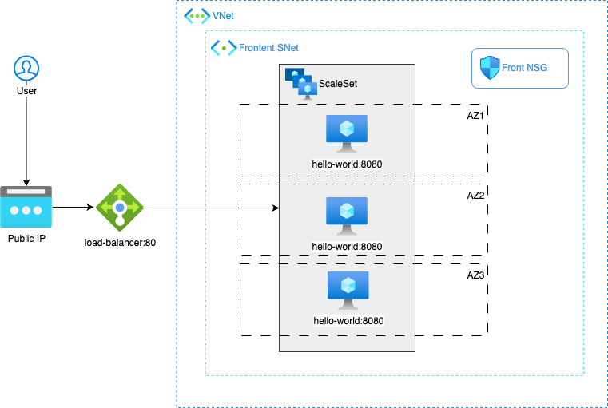
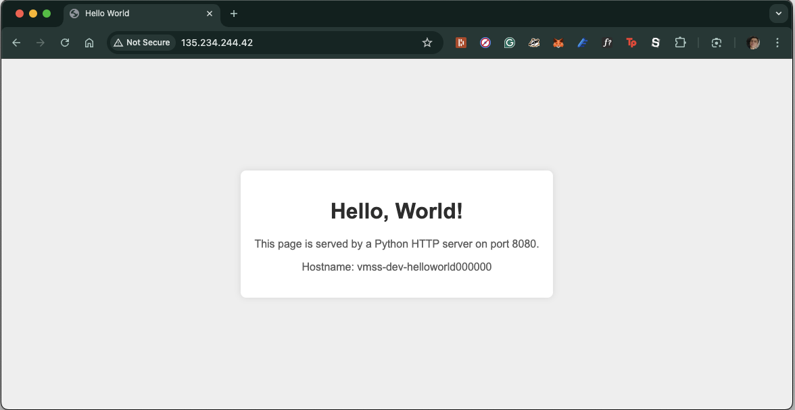

# aegp-terraform-challenge

Deployment of a Hello-World application on Azure using Terraform and Atmos. 

## Table of Contents

- [The hello-world Terraform Component](#the-hello-world-terraform-component)
  - [Terraform Modules Overview](#terraform-modules-overview)
  - [Module Breakdown](#module-breakdown)
  - [File Structure](#file-structure)

- [Azure provider authentication](#azure-provider-authentication)
- [Running with Atmos](#running-with-atmos)
- [Development stack architecture](#development-stack-architecture)
- [Results](#results)


## The hello-world Terraform Component

This Terraform component deploys a "Hello World" application infrastructure on Azure. It includes a Virtual Network (VNet), subnets, Network Security Groups (NSGs), a Load Balancer, and a Virtual Machine Scale Set (VMSS) to host the application.

## Terraform Modules Overview

The `hello-world` component is structured using several distinct Terraform modules, each responsible for a specific set of resources. This separation of concerns is a core best practice in Terraform, leading to a more maintainable, reusable, and understandable infrastructure codebase. This separation allows for modularity, reusability, maintainability, testability, collabation and clarity.

### Module Breakdown:

1.  **`network` Module (`./modules/network/`)**
    *   **Purpose:** Responsible for creating the foundational networking infrastructure.
    *   **Key Resources:**
        *   Azure Virtual Network (VNet)
        *   Subnets (e.g., for frontend, backend, database tiers)
    *   **Best Practices:** Accepts VNet address space and subnet definitions as inputs, allowing flexible network design. Outputs subnet details for use by other modules.

2.  **`security` Module (`./modules/security/`)**
    *   **Purpose:** Manages network security configurations.
    *   **Key Resources:**
        *   Azure Network Security Groups (NSGs)
        *   NSG Rules
        *   Associations between NSGs and subnets.
    *   **Best Practices:** Takes NSG definitions (including rules) and subnet information as input. This allows for granular control over traffic flow between subnets and to/from the internet.

3.  **`load_balancer` Module (`./modules/load_balancer/`)**
    *   **Purpose:** Sets up the public-facing load balancer to distribute traffic to the application.
    *   **Key Resources:**
        *   Azure Public IP Address
        *   Azure Load Balancer (LB)
        *   LB Frontend IP Configuration
        *   LB Backend Address Pool
        *   LB Health Probe
        *   LB Rules
    *   **Best Practices:** Configures essential load balancing components, exposing parameters like ports and probe settings. Outputs IDs needed by the compute module to join the backend pool.

4.  **`compute` Module (`./modules/compute/`)**
    *   **Purpose:** Deploys the application hosting infrastructure.
    *   **Key Resources:**
        *   Azure Virtual Machine Scale Set (VMSS)
        *   VMSS OS configuration, extensions (e.g., custom script for app setup)
        *   Autoscaling settings for the VMSS.
    *   **Best Practices:** Takes subnet ID, load balancer backend pool ID, and health probe ID as inputs to integrate with the network and load balancer. Manages VMSS configuration, including image, SKU, admin access, and custom data for application deployment.

### File Structure

The `hello-world` component and its modules are organized as follows:

```
hello-world/
├── main.tf                 # Root module main configuration (orchestrates module calls)
├── variables.tf            # Root module variable definitions
├── outputs.tf              # Root module output definitions
├── versions.tf             # Terraform and provider version constraints
├── dev.tfvars              # Example variable values for a 'dev' environment (for direct Terraform usage)
├── modules/
│   ├── compute/
│   │   ├── main.tf
│   │   ├── variables.tf
│   │   ├── outputs.tf
│   │   └── scripts/
│   │       └── setup_hello_world.sh  # Example script for VMSS custom_data
│   ├── load_balancer/
│   │   ├── main.tf
│   │   ├── variables.tf
│   │   └── outputs.tf
│   ├── network/
│   │   ├── main.tf
│   │   ├── variables.tf
│   │   └── outputs.tf
│   └── security/
│       ├── main.tf
│       ├── variables.tf
│       └── outputs.tf
└── README.md               # The README for the Terraform component
```

## Azure provider authentication

For this challenge I'm using a Service Principal with a Client Secret to authenticate witht he Azure Provider, by setting the following variables:

        export ARM_CLIENT_ID="00000000-0000-0000-0000-000000000000"
        export ARM_CLIENT_SECRET="12345678-0000-0000-0000-000000000000"
        export ARM_TENANT_ID="10000000-0000-0000-0000-000000000000"
        export ARM_SUBSCRIPTION_ID="20000000-0000-0000-0000-000000000000"

## Running with Atmos

While it is possible to run this Terraform component directly using `terraform apply -var-file="dev.tfvars"`, in this case I am using Atmos to manage configurations across multiple environments and stacks.

The atmos configuration is as follows

```
├── atmos.yml
├── components/
│   └── terraform/
│       └── hello-world/
│   # Centralized stacks configuration
└── stacks/
    ├── catalog/
    │   └── hello-world.yml
    └── deploy/
        ├── dev.yml
        ├── prod.yml
        └── staging.yml
```

Under `stacks/catalog/hello-world.yml` there is the baseline definition for the hello-world app. Environment-specific configurations are placed under `stacks/deploy/<env>.yml`.

First, make sure you have atmos installed in your system. For Mac, run

        brew install atmos

Then, to deploy the development stack, run the following command

        atmos terraform apply hello-world -s dev

To destroy the stack, run

        atmos terraform destroy hello-world -s dev

## Development stack architecture

This simple setup only uses the web subnet to deploy a basic webserver running a hello-world page, with info about the host that resolves the request.




## Results


